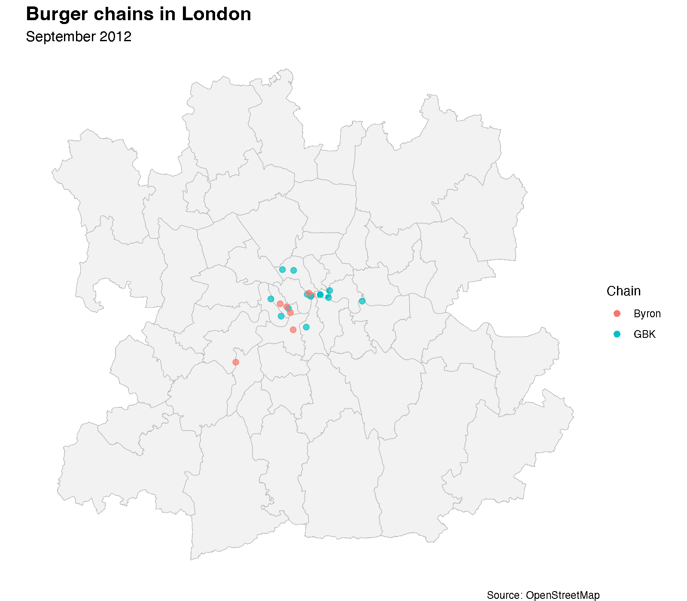

I was having lunch at Honest Burgers near campus with a few people and the conversation somehow turned to Byron, the burger chain, and I found myself telling the story of its rise and downfall.
Or, at least, a very simplistic version of it based on my limited knowledge of what happened.
But that led me to wonder if it would be possible to map the fortunes of Byron.
The following is an attempt at doing so.

# Finding data

In order to find the data, I will use OpenStreetMap data, using the `osmdata` package in R.
The idea is simple: query the Overpass API for restaurants matching our burger chain names within the London bounding box.

```{r setup, message=FALSE, warning=FALSE}
library(osmdata)
library(sf)
library(dplyr)
library(ggplot2)
library(ggspatial)
library(rmapshaper)
library(ragg)
library(future)
library(furrr)
library(gifski)
```

My first attempt was to search for restaurants by name:

```{r first_attempt, eval=TRUE}
london <- getbb("London, UK")

london_b <- london |>
  opq() |>
  add_osm_feature(key = "amenity", value = "restaurant") |>
  add_osm_feature(key = "name",
                  value = c("Byron", "Gourmet Burger Kitchen", "Five Guys",
                            "Honest Burger", "GBK"),
                  match_case = FALSE, value_exact = FALSE) |>
  osmdata_sf()
```

This highlights some data issues. Of the 3 Byrons in London, this only catches 2. Of the 9 GBK in London, it only catches 3. And I catch none of the Five Guys!

Maybe there is some vagueness in the classification and some of these get classified as fast food rather than restaurants? Let's widen the net:

```{r second_attempt, eval=TRUE}
london_b2 <- london |>
  opq() |>
  add_osm_feature(key = "amenity", value = c("restaurant", "fast_food")) |>
  add_osm_feature(key = "name",
                  value = c("Byron", "Gourmet Burger Kitchen", "Five Guys",
                            "Honest Burger", "GBK"),
                  match_case = FALSE, value_exact = FALSE) |>
  osmdata_sf()
```

This is better---we now catch Five Guys, and more of the Gourmet Burger Kitchen (7/9), but still only 2 out of 3 Byrons.
Let's go even wider and include food courts, bars, cafes and pubs:

```{r third_attempt, eval=TRUE}
london_b3 <- london |>
  opq() |>
  add_osm_feature(key = "amenity",
                  value = c("restaurant", "fast_food", "food_court",
                            "bar", "cafe", "pub")) |>
  add_osm_feature(key = "name",
                  value = c("Byron", "Gourmet Burger Kitchen", "Five Guys",
                            "Honest Burger", "GBK"),
                  match_case = FALSE, value_exact = FALSE) |>
  osmdata_sf()
```

This doesn't yield anything further, but it doesn't hurt to cast the wider net---it makes the query more robust across time periods when amenity classifications may have been different. So let's stick with this broader set of amenity types.

I also need to standardize the chain names. The raw `name` field from OpenStreetMap can vary (e.g., "GBK" vs "Gourmet Burger Kitchen", or "Byron Burgers" vs "Byron"). A `case_when` mapping handles this.

# Building a reusable query function

Since we'll need to run this query many times across different dates, let's wrap it in a function:

```{r query_function}
query_burger_chains <- function(bbox, datetime = NULL, timeout = 300) {
  q <- bbox |>
    opq(datetime = datetime, timeout = timeout) |>
    add_osm_feature(
      key = "amenity",
      value = c("restaurant", "fast_food", "food_court", "bar", "cafe", "pub")
    ) |>
    add_osm_feature(
      key = "name",
      value = c("Byron", "Gourmet Burger Kitchen", "Five Guys",
                "Honest Burger", "GBK"),
      match_case = FALSE, value_exact = FALSE
    ) |>
    osmdata_sf()

  pts <- q$osm_points[!is.na(q$osm_points$name), ]

  pts |>
    dplyr::mutate(
      chain = dplyr::case_when(
        grepl("five guys", name, ignore.case = TRUE) ~ "Five Guys",
        grepl("gourmet burger kitchen|\\bgbk\\b", name, ignore.case = TRUE) ~ "GBK",
        grepl("honest burger", name, ignore.case = TRUE) ~ "Honest Burgers",
        grepl("byron", name, ignore.case = TRUE) ~ "Byron",
        TRUE ~ NA_character_
      )
    ) |>
    dplyr::filter(!is.na(chain))
}
```

# Going back in time

With OpenStreetMap, it is possible to query the state of the database at any point going back to 12 September 2012, when the licence of the data changed.
This is done using the `datetime` argument in `opq()`.

**An important caveat:** OSM historical data reflects the state of the OSM *database* at that time, not ground truth. If a restaurant existed but nobody had mapped it yet, it won't appear. Early snapshots (2012--2014) will likely have sparse data as OSM coverage of commercial establishments was less complete. What we're mapping is really the intersection of "this restaurant existed" and "someone added it to OpenStreetMap".

I built a series of dates from September 2012 to today, querying roughly every six months, and collected the data using a [standalone script](collect_data.R) that saves each snapshot incrementally. This approach is necessary because the Overpass API can be slow for historical queries and occasionally times out --- saving after each successful query means we never lose progress.

```{r load_data}
london_admin <- readRDS("data/london_admin.rds")
london_admin_simple <- ms_simplify(london_admin, keep = 0.15)
all_data <- readRDS("data/all_data.rds")

all_data |> sf::st_drop_geometry() |> count(chain)
```

```{r snapshot_summary}
n_snapshots <- length(unique(all_data$snapshot_date))
date_range <- range(all_data$snapshot_date)
message("Loaded ", nrow(all_data), " records across ", n_snapshots,
        " snapshots from ", format(date_range[1], "%b %Y"),
        " to ", format(date_range[2], "%b %Y"))
```

# A first look at the data

Before jumping to maps, let's look at the count of locations for each chain over time. This gives us a quick overview of the dynamics:

```{r count_plot, fig.width=8, fig.height=5}
count_data <- all_data |>
  sf::st_drop_geometry() |>
  dplyr::count(snapshot_date, chain)

ggplot(count_data, aes(x = snapshot_date, y = n, colour = chain)) +
  geom_line(linewidth = 0.8) +
  geom_point(size = 1.5) +
  labs(
    title = "Burger chains in London over time",
    subtitle = "Number of locations in OpenStreetMap",
    x = NULL, y = "Number of locations", colour = "Chain"
  ) +
  theme_minimal()
```

Remember the OSM data quality caveat: the early part of the series likely underestimates the true number of locations, as many restaurants hadn't been mapped yet. The trends from ~2015 onwards are more reliable.

# Mapping the data

Let's start with a static faceted view, selecting a snapshot roughly every two years to see the broad spatial patterns:

```{r faceted_maps, fig.width=10, fig.height=8}
time_points <- sort(unique(all_data$snapshot_date))
selected_dates <- time_points[seq(1, length(time_points), by = 4)]

facet_data <- all_data |>
  dplyr::filter(snapshot_date %in% selected_dates) |>
  dplyr::mutate(date_label = format(snapshot_date, "%b %Y"))

# Order date labels chronologically
facet_data$date_label <- factor(
  facet_data$date_label,
  levels = format(sort(selected_dates), "%b %Y")
)

ggplot() +
  geom_sf(data = london_admin, fill = "grey95", colour = "grey70") +
  geom_sf(data = facet_data, aes(colour = chain), size = 1.5, alpha = 0.7) +
  facet_wrap(~ date_label) +
  labs(
    title = "Burger chains in London",
    colour = "Chain",
    caption = "Source: OpenStreetMap"
  ) +
  theme_void() +
  theme(strip.text = element_text(face = "bold"))
```

# Animating the maps

Now for the fun part. We render each snapshot as a separate frame in parallel using `furrr` and `ragg`, then stitch them into a GIF with `gifski`. Each frame shows the actual state of the data at that snapshot date --- no interpolation between dates.

```{r animation}
dir.create("img/frames", showWarnings = FALSE, recursive = TRUE)

unique_dates <- sort(unique(all_data$snapshot_date))

plan(multisession, workers = parallelly::availableCores())

furrr::future_walk(seq_along(unique_dates), function(i) {
  frame_data <- all_data |> dplyr::filter(snapshot_date == unique_dates[i])

  p <- ggplot() +
    geom_sf(data = london_admin_simple, fill = "grey95", colour = "grey70") +
    geom_sf(data = frame_data, aes(colour = chain), size = 2, alpha = 0.7) +
    labs(
      title = "Burger chains in London",
      subtitle = format(unique_dates[i], "%B %Y"),
      colour = "Chain",
      caption = "Source: OpenStreetMap"
    ) +
    theme_void() +
    theme(
      plot.title = element_text(size = 16, face = "bold"),
      plot.subtitle = element_text(size = 12)
    )

  ggsave(
    sprintf("img/frames/frame_%03d.png", i), p,
    width = 8, height = 7, dpi = 200, device = agg_png
  )
}, .options = furrr_options(seed = TRUE))

frame_files <- sort(list.files("img/frames", pattern = "frame_.*png$",
                               full.names = TRUE))
gifski(frame_files, gif_file = "img/byron_animation.gif",
       width = 1600, height = 1400, delay = 4/3)

unlink("img/frames", recursive = TRUE)
```



# Conclusion

The animated map tells a story --- though one that needs to be read with care given the limitations of OSM historical data.

Byron's trajectory is visible: a handful of locations appearing in the mid-2010s, then gradually disappearing as the chain contracted and eventually entered administration. Meanwhile, Five Guys and Honest Burgers have been steadily expanding, filling the gaps that Byron and others left behind.

The data also highlights the challenge of using crowd-sourced geographic data as a historical record. OpenStreetMap is fantastic for current data, but its historical coverage depends on when volunteer mappers got around to adding or updating entries. The early years of our time series almost certainly undercount all the chains.

Despite these limitations, the combination of `osmdata`, `sf`, and `ggplot2` provides a compelling way to visualize the spatial dynamics of business competition. The same approach could be applied to any category of point-of-interest data in OpenStreetMap --- coffee shops, bookstores, banks, or any other business with a distinctive name.
